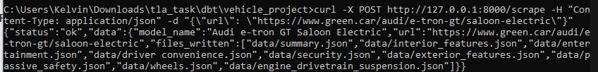
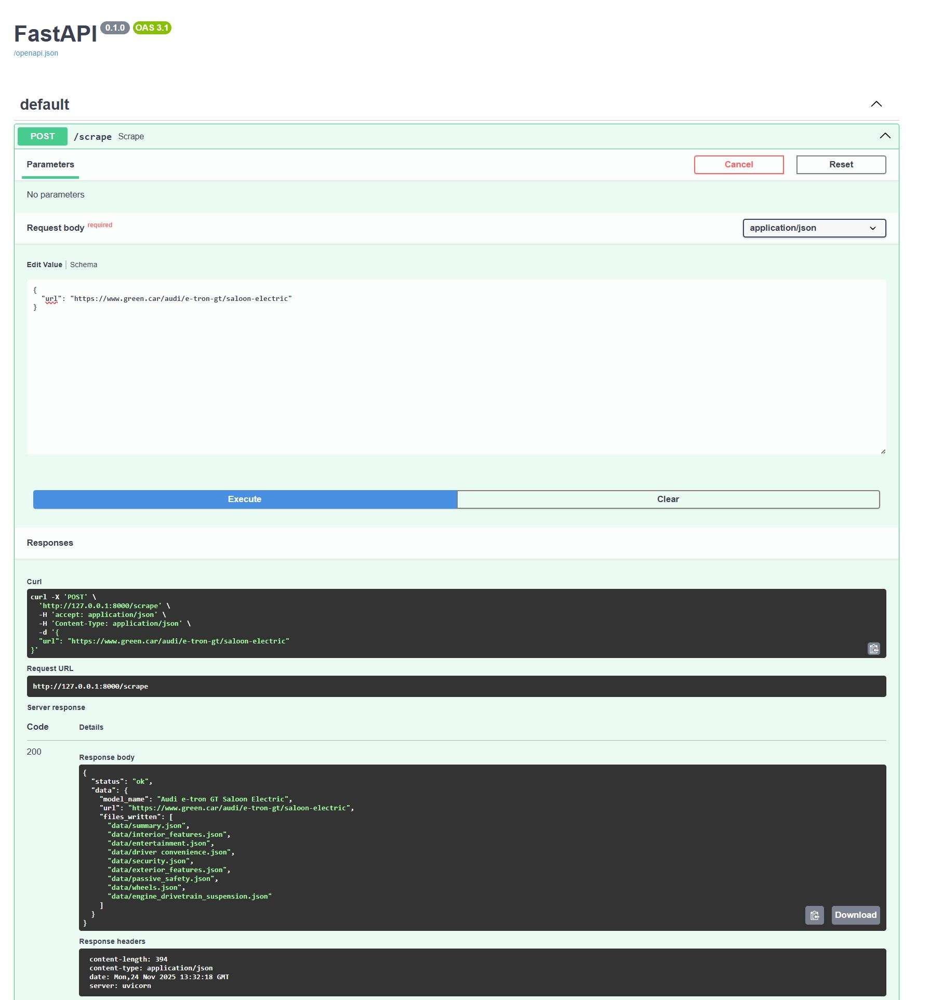
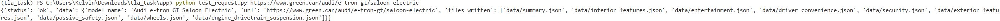

# Vehicle Scraper & API

This project is a small data pipeline that:

1. Scrapes **vehicle details** from a Green.Car model page using **Selenium**  
2. Saves the results as JSON files into a local `data/` folder  
3. Exposes the scraper via a **FastAPI** endpoint: `POST /scrape`  
4. Feeds those JSON files into **dbt + DuckDB** using a medallion (bronze/silver/gold) architecture.

The example model page used here is:

- `https://www.green.car/audi/e-tron-gt/saloon-electric`

---

## 1. Project Structure

```text
app/
├─ app.py                     # FastAPI entrypoint (defines /scrape)
├─ scraper/
│  ├─ web_scrape.py          # run_scrape(url): main scraping pipeline
│  ├─ schemas.py             # Expected Schemas for each section of the webscrape
│  └─ modules/
│     ├─ actions.py          # low-level Selenium interactions (get title, accept cookies, etc.)
│     └─ parse.py            # functions that apply schemas, write JSON, etc.
├─ data/
│  ├─ summary.json           # summary stats (boot space, range, etc.)
│  ├─ interior_features.json # interior feature flags (booleans)
│  └─ entertainment.json     # entertainment feature flags (booleans)
├─ dbt/                      # dbt project
├─ requirements.txt
└─ README.md
```

## 2. Tech Stack

Python 3.9.0+ (recommended)

Selenium – browser automation & scraping

Chrome (or another browser) + WebDriver

FastAPI – API framework

Uvicorn – ASGI server to run FastAPI

Pydantic – request validation

DuckDB + dbt-duckdb – for analytics models (bronze/silver/gold)

## 3. Scraper Logic (High Level)

The scraper (run_scrape(url)) roughly does:

1. Create Selenium driver

2. driver.get(url)

3. Accept cookies

4. Get model title

5. Scrape summary card stats → apply SUMMARY_SCHEMA → append to data/summary.json

6. For accordion sections (Interior Features, Entertainment, etc.):

    Expand the accordion

    - Extract each row (feature name + check/cross icon)

    - Map icon to a boolean: True / False

    - Apply FEATURES_SCHEMA

    - Append to the relevant JSON file (e.g. data/interior_features.json)

7. Quit the driver

8. Return some summary result (e.g. model name, keys of files written, etc.)

## 4. Usage

Start the server

`uvicorn app:app --reload` or `python app.py`

1. Windows CMD Example
`curl -X POST http://127.0.0.1:8000/scrape -H "Content-Type: application/json" -d "{\"url\": \"https://www.green.car/audi/e-tron-gt/saloon-electric\"}"`



2. Swagger Example

`http://127.0.0.1:8000/docs`

Go to `http://127.0.0.1:8000/docs#/default/scrape_scrape_post`, click try it out and input desired webpage to scrape.



3. Python Example

`python test_request.py https://www.green.car/audi/e-tron-gt/saloon-electric`



## 5. dbt + DuckDB Integration

Once scraped JSON is stored under data/, dbt processes them:

**Bronze**
- Reads raw JSON into DuckDB tables
- No transformation

**Silver**

- Parses text → numeric fields
- Cleans booleans
- Deduplicates by newest timestamp
- Adds brand column

**Gold**

- Produces a vehicle_features table, 
- Achieved via UNPIVOT + UNION ALL

Run dbt models:

`dbt build` or `dbt run --select car_models`
